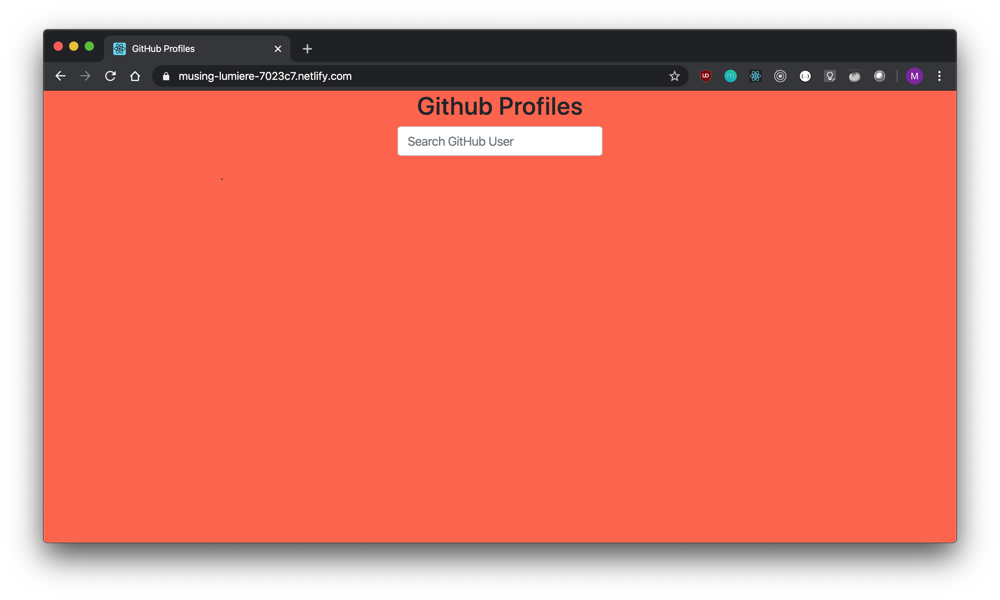
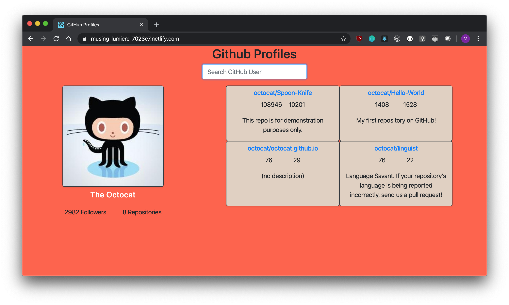

[](https://app.netlify.com/sites/musing-lumiere-7023c7/deploys)

## Overview

A simple react app to which fetches GitHub users and retrieves their top 4 repositories based on stars and forks by calling public GitHub APIs.

## Screenshots

<div>
    
    
</div>

## Running locally

Clone the repo, navigate into it, install dependencies, run tests and start dev server
```
git clone https://github.com/palm002/github-profiles.git
cd github-profiles
yarn install
yarn test
yarn start
```

Alternatively, you can run the finished build with docker:

`docker run -d -p 8080:80 mirks/gh-profiles:latest`

You can access the static content on `localhost:8080`


## Developing and testing with Docker Compose

Clone the repo `git clone https://github.com/palm002/github-profiles.git`

and navigate into it `cd github-profiles`

`docker-compose up --build` will start the development server with hot reload and run tests.

`docker-compose up --build dev` builds and runs only the dev service while 

`docker-compose up --build test` builds and runs the tests.


## Demo

https://musing-lumiere-7023c7.netlify.com/
